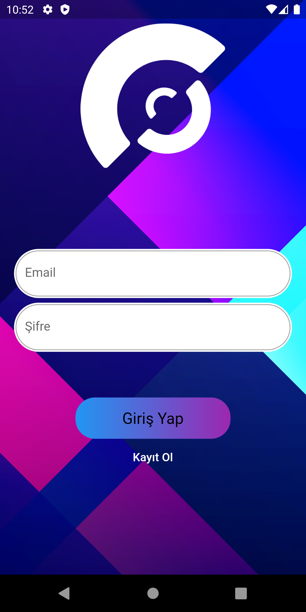

# Event Buddy

Event Buddy app is the perfect solution for people who don't want to go to concerts, theaters and similar events alone and want to meet new people.

Users can register as attendees for events and wait to receive requests from other users, or they can list event attendees and send requests to them.

If users accept the requests, the messaging option will open and they will be able to communicate.

Here are the images and features of the application!

 
 
 
 
 
 
 
 
 
 
 
